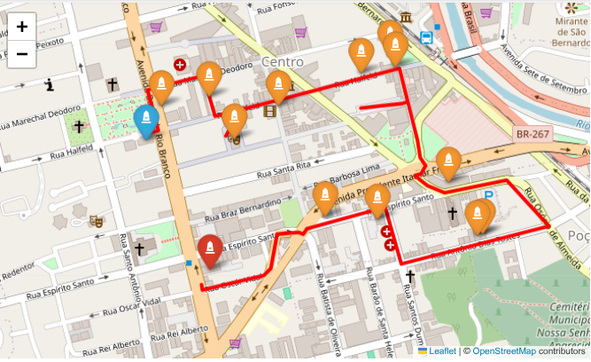

# Mapeamento de rotas com OSMnx

Utilizamos a biblioteca do Python **OSMnx**, desenvolvida e mantida por
Geoff Boeing, professor de Planejamento Urbano e Análise Espacial da
USC - University of Southern California, para calcular e visualizar a
rota mais curta entre pontos de interesse, que fazem parte do circuito
turístico denominado [Museu de Percurso Raphael
Arcuri](https://www.instagram.com/museuraphaelarcuri?igsh=MWRjNWV1cnZnczE5aQ==),
de acordo com o projeto desenvolvido por [Letícia
Rabelo](https://www.instagram.com/leticiarabelo.arq?igsh=dndsYTdsemM4ZWdw).

### Importamos bibliotecas

``` python
import osmnx as ox
import pandas as pd
import numpy as np
#import geopandas as gpd 
import folium
from folium.plugins import Fullscreen
from shapely.geometry import Point
from sklearn.neighbors import NearestNeighbors
```

### Identificamos a versão do pacote OSMnx

Verificamos a versão do **OSMnx** para garantir compatibilidade:

``` python
print(f"Versão do OSMnx: {ox.__version__}")
```


    Versão do OSMnx: 2.0.3

### Definimos os pontos de interesse

Armazenamos os locais em um dicionário com as coordenadas:

``` python
coordenadas_referencia = {
    "Paço Municipal": (-21.761600, -43.349999),
    "ED. CIAMPI": (-21.761080, -43.349367),
    "Galeria Pio X": (-21.760661, -43.348583),
    "Cine Theatro Central": (-21.761135, -43.347926),
    "Palacete Pinho": (-21.760593, -43.346864),
    "Cia. Dias Cardoso": (-21.759881, -43.344195),
    "Hotel Príncipe": (-21.7599733, -43.3440394),
    "Associação Comercial": (-21.759881, -43.344195),
    "Cia. Pantaleone Arcuri": (-21.762536, -43.342788),
    "Vila Iracema": (-21.763336, -43.344481),
    "Palacete dos Fellet": (-21.763280,	-43.345717),
    "Residência Raphael Arcuri": (-21.763699, -43.342097),
    "Castelinho dos Bracher": (-21.763666, -43.341959),
    "Casa D'Itália": (-21.764455, -43.348467)
}
```

### Criamos o data frame a partir do dicionário

Convertemos as coordenadas para um *data frame*:

``` python
df = pd.DataFrame.from_dict(coordenadas_referencia, 
                            orient='index', 
                            columns=['latitude', 'longitude'])

# Resetar o índice para ter uma coluna com os nomes dos locais
df = df.reset_index().rename(columns={'index': 'obra'})
```

### Calculamos a rota mais curta

A classe *NearestNeighbors* do módulo *sklearn.neighbors*, junto com o
algoritmo *ball_tree*, fornece uma solução robusta para problemas de
busca por proximidade, como o do roteamento entre pontos geográficos.

``` python
# Calcular a distância para cada par de pontos consecutivos
X = np.array(df[['latitude', 'longitude']])
obras = df['obra']
nbrs = NearestNeighbors(n_neighbors=len(X), algorithm='ball_tree').fit(X)
distances, indices = nbrs.kneighbors(X)

# Encontrar o roteiro mais curto
visited = np.zeros(len(X), dtype=bool)

end_point = 13  # Definindo o ponto final como 13 (Casa d'Itália)

visited[0] = True
tour = [0]
current = 0

# Modificado para parar quando chegar ao ponto 13
while current != end_point and len(tour) < len(X):
    unvisited_mask = np.logical_not(visited[indices[current]])
    if np.any(unvisited_mask):
        nearest = indices[current][unvisited_mask][0].item()
    else:
        # Se todos os vizinhos foram visitados, escolha o próximo não visitado
        unvisited = np.where(visited == False)[0]
        if len(unvisited) > 0:
            nearest = unvisited[0]
        else:
            break
    
    tour.append(nearest)
    visited[nearest] = True
    current = nearest

    # Se chegou ao ponto final, pare
    if current == end_point:
        break

# Nomes dos locais na ordem original
obras = df['obra'].tolist()  

# Ordenar o dicionário conforme a rota
coordenadas_ordenadas = {
    obras[i]: coordenadas_referencia[obras[i]] 
    for i in tour
}

# Resultado
print("Rota mais curta terminando no item 12:")
for i, point in enumerate(tour):
    print(f"{i}. {obras[point]} (Ponto {point})")
```


    Rota mais curta terminando no item 12:
    0. Paço Municipal (Ponto 0)
    1. ED. CIAMPI (Ponto 1)
    2. Galeria Pio X (Ponto 2)
    3. Cine Theatro Central (Ponto 3)
    4. Palacete Pinho (Ponto 4)
    5. Cia. Dias Cardoso (Ponto 5)
    6. Associação Comercial (Ponto 7)
    7. Hotel Príncipe (Ponto 6)
    8. Cia. Pantaleone Arcuri (Ponto 8)
    9. Residência Raphael Arcuri (Ponto 11)
    10. Castelinho dos Bracher (Ponto 12)
    11. Vila Iracema (Ponto 9)
    12. Palacete dos Fellet (Ponto 10)
    13. Casa D'Itália (Ponto 13)

### Criamos o dicionário da rota mais curta

``` python
# Nomes dos locais na ordem original
obras = df['obra'].tolist()  

# Ordenar o dicionário conforme a rota
coordenadas_ordenadas = {
    obras[i]: coordenadas_referencia[obras[i]] 
    for i in tour
}
```

### Definimos o percurso a pé

Usamos o pacote **OSMnx** para criar um grafo da rede viária para
pedestres. Para cada par de pontos consecutivos, calculamos o caminho
mais curto no grafo:

``` python

# Transformar os valores do dicionário em uma lista de tuplas
itinerario = list(coordenadas_ordenadas.values())

# Criar grafo de caminhada ao redor do primeiro ponto
G = ox.graph_from_point(itinerario[0], dist=1500, network_type='walk')

# 2. Criar caminho completo conectando todos os pares consecutivos
full_path = []

for i in range(len(itinerario) - 1):
    orig_point = itinerario[i]
    dest_point = itinerario[i + 1]
    
    try:
        orig_node = ox.distance.nearest_nodes(G, orig_point[1], orig_point[0])  
        dest_node = ox.distance.nearest_nodes(G, dest_point[1], dest_point[0])
        
        segment = ox.shortest_path(G, orig_node, dest_node, weight='length')
        
        # Evitar duplicações de nós
        if full_path and full_path[-1] == segment[0]:
            full_path += segment[1:]
        else:
            full_path += segment
    except Exception as e:
        print(f"Erro ao processar trecho entre {orig_point} e {dest_point}: {e}")

# Obter coordenadas (lat, lon) dos nós do caminho
route_coords = [(G.nodes[n]['y'], G.nodes[n]['x']) for n in full_path]
```

### Visualizamos o mapa

Criamos um mapa interativo com o pacote **Folium**:

``` python
# Criar mapa
mapa = folium.Map(location=itinerario[0], zoom_start=15)

# Adicionar pontos do itinerário como marcadores com ícones personalizados
nomes = list(coordenadas_ordenadas.keys())
for idx, (nome, coord) in enumerate(zip(nomes, coordenadas_ordenadas.values())):
    if idx == 0:
        icon_color = 'blue'
    elif idx == len(coordenadas_ordenadas) - 1:
        icon_color = 'red'
    else:
        icon_color = 'orange'
    
    folium.Marker(
        coord,
        tooltip=nome,
        icon=folium.Icon(icon="monument", color=icon_color, prefix="fa")
    ).add_to(mapa)

# Adicionar a linha da rota em vermelho
folium.PolyLine(route_coords, color='red', weight=4).add_to(mapa)

# Exibir o mapa
mapa
```


**Considerações finais**

Personalizamos os ícones dos marcadores com cores distintas para
identificar cada etapa do percurso.

O código pode ser adaptado para tarefas distintas, como roteiros
turísticos otimizados, planejamento de entregas, análise de
acessibilidade urbana e simulações de evacuação, em casos de desastres
naturais.

Baixe o arquivo *percurso.png* para visualizar o mapa interativo no navegador da sua preferência.

**Referências**

Boeing, G. (2025). Modeling and Analyzing Urban Networks and Amenities
with OSMnx. Geographical Analysis, published online ahead of print.
<doi:10.1111/gean.70009>

SCIKIT-LEARN. User Guide: Nearest Neighbors. 2025. Disponível em:
<https://scikit-learn.org/stable/modules/neighbors.html>. Acesso em: 18
JUN 2025.

